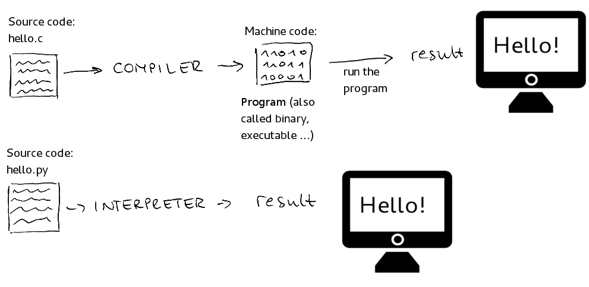
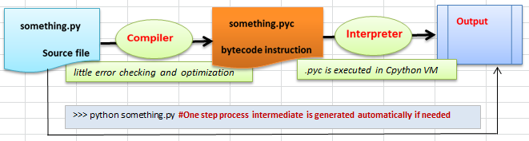

# Overview Python

## Compiled or Interpreted?

### Difference between C and Python

### Python Compiler and Interpreter

### How Python is interpreted?
An interpreter is a kind of program that executes other programs. When you write Python programs , it converts source code written by the developer into intermediate language which is again translated into the native language / machine language that is executed.

The python code you write is compiled into python bytecode, which creates file with extension .pyc . The bytecode compilation happened internally, and almost completely hidden from developer. Compilation is simply a translation step, and byte code is a lower-level, and platform-independent , representation of your source code. Roughly, each of your source statements is translated into a group of byte code instructions. This byte code translation is performed to speed execution byte code can be run much quicker than the original source code statements.

The .pyc file , created in compilation step, is then executed by appropriate virtual machines. The Virtual Machine just a big loop that iterates through your byte code instructions, one by one, to carry out their operations. The Virtual Machine is the runtime engine of Python and it is always present as part of the Python system, and is the component that truly runs the Python scripts . Technically, it's just the last step of what is called the Python interpreter.

### Difference between .py and .pyc files?
Python compiles the .py files and saves it as .pyc files , so it can reference them in subsequent invocations. The .pyc contain the compiled bytecode of Python source files. The .pyc contain the compiled bytecode of Python source files, which is what the Python interpreter compiles the source to. This code is then executed by Python's virtual machine . There's no harm in deleting them (.pyc), but they will save compilation time if you're doing lots of processing.

Python is an interpreted language , as opposed to a compiled one, though the distinction can be blurry because of the presence of the bytecode compiler. Compiling usually means converting to machine code which is what runs the fastest. But interpreters take human readable text and execute it. They may do this with an intermediate stage .

For example, When you run myprog.py source file, the python interpreter first looks to see if any 'myprog.pyc' (which is the byte-code compiled version of 'myprog.py') exists, and if it is more recent than 'myprog.py'. If so, the interpreter runs it. If it does not exist, or 'myprog.py' is more recent than it (meaning you have changed the source file), the interpreter first compiles 'myprog.py' to 'myprog.pyc'.